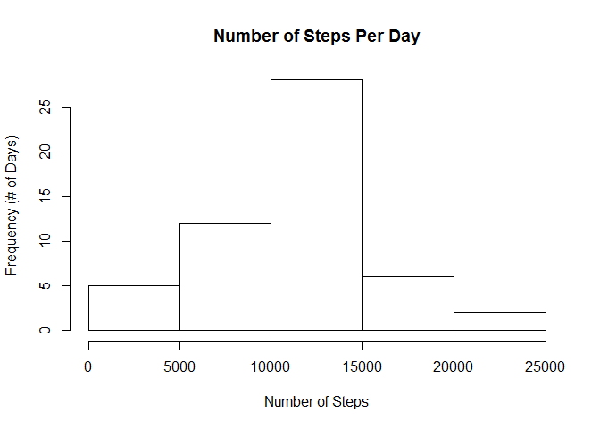
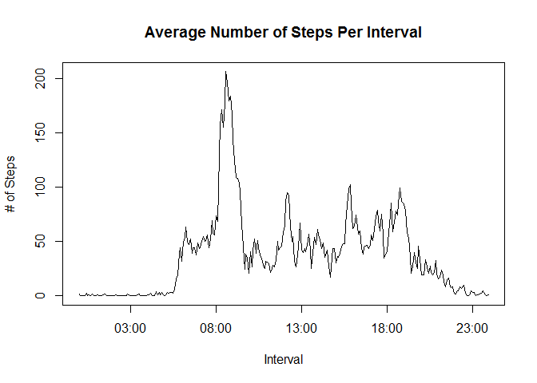
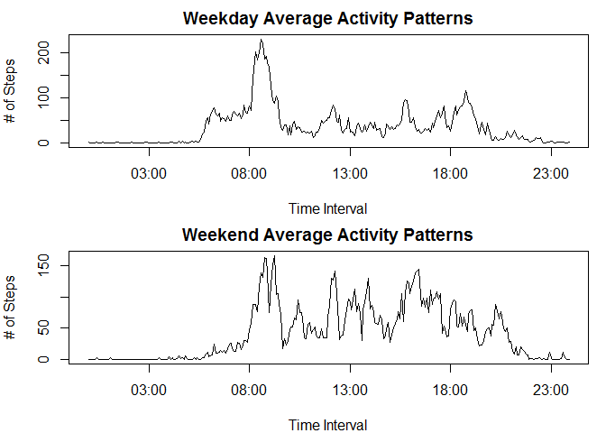

# Reproducible Research: Peer Assessment 1
by: Mark Rhine


```r
setwd("C:/Users/Mark Account/Documents/Software/Coursera/Reproducible Research")
#turns off scientific notation
options(scipen=999)
```


## Loading and preprocessing the data

Before I analyzed the data, I loaded the data into R software. I had downloaded the zip file
from https://github.com/rdpeng/RepData_PeerAssessment1/blob/master/activity.zip?raw=true. 

I saved the file in my current working dirctory of current R file. Then I unzipped the file in the same diectory. activity.csv is the file containing the raw data.


```r
#unzips file and extracts it in same directory level.
unzip("./activity.zip")
```
Next, I created a data frame from the data table in activity.csv, I titled the data frame "DataFrame". I had to convert the date variable into a Date data type. Now the activity data set is ready to be analyzed. 


```r
#read in data file
dataFrame <- read.csv("./activity.csv", header = TRUE)

#convert the date column into a character type. It is just an intermediary step.
dataFrame[,2] <- as.character(dataFrame[,2])

#convert the date column into a Date data type.
dataFrame[,2] <- as.Date(dataFrame[,2], format = "%Y-%m-%d")
```


## What is mean total number of steps taken per day?

To answer this question, I ignored any NA data points. Using the dplyr library, I grouped the step data by each date. Then I calculated the sum of all of the steps for each day.


```r
library(dplyr)
```

```
## 
## Attaching package: 'dplyr'
## 
## The following object is masked from 'package:stats':
## 
##     filter
## 
## The following objects are masked from 'package:base':
## 
##     intersect, setdiff, setequal, union
```

```r
#remove NA from data set
#Find only complete rows
good <- complete.cases(dataFrame)

#data set only includes complete data.
CompleteData <- dataFrame[good,]

#creates a data frame of total steps per day.
gg <- group_by(CompleteData, date)
pp <- summarise(gg, sumSteps = sum(steps))
sumOfStepsPerDay <- data.frame(pp)
```

This is a frequency histogram that hows the distribution of total number of steps per day.


```r
#create a histogram
hist(sumOfStepsPerDay$sumSteps, main = "Number of Steps Per Day", 
     xlab = "Number of Steps", ylab = "Frequency (# of Days)")
```

 

We can see that the distribution is approximately normal. It is not skewed left or right. By far, the highest frequency was a range of 10,000 - 15,000 steps. With a distribution that is not skewed, we can use the mean or median to describe the average. 


```r
#mean
mean1 <- mean(sumOfStepsPerDay$sumSteps)
mean1
```

```
## [1] 10766.19
```

```r
#median
median1 <- median(sumOfStepsPerDay$sumSteps)
median1
```

```
## [1] 10765
```

As the results show, the mean total steps per day is 10766.1886792, and the median is 10765. 


## What is the average daily activity pattern?

To visualize the average daily activity pattern (a day in the life) I had to calculate the average number of steps for each time interval (over the course of the two months). Again, I ignored NA values. 

I grouped the data by Interval. Then I calculated the mean number of steps for each 5 minute interval. I converted the Interval into a time variable as the interval is just the time of day. For example, 230 is 2:30 on a 24 hour clock.


```r
#create a copy of our complete row only Data Set, as to not ruin old set.
Data2 <- CompleteData

#turn scientific notation off
options(scipen=999)


#group by time interval
groupedByTime <- group_by(Data2, interval)
yyy <- summarise(groupedByTime, avgSteps = mean(steps))
avgStepsPerInterval <- data.frame(yyy)

#Convert interval to time
library(stringr)
avgStepsPerInterval2 <- avgStepsPerInterval
avgStepsPerInterval2$time <- avgStepsPerInterval2$interval
avgStepsPerInterval2$time <- as.character(avgStepsPerInterval2$time)
#pad the interval with 0's if it is less than 4 digits long. This ensures proper conversion.
avgStepsPerInterval2$time <- str_pad(avgStepsPerInterval2$time, width = 4, side = "left", pad = "0")
avgStepsPerInterval2$time <- strptime(avgStepsPerInterval2$time, "%H%M")
```

The following plot will visualize the average daily activity pattern.


```r
plot(avgStepsPerInterval2$time, avgStepsPerInterval$avgSteps, type = "l",
     main = "Average Number of Steps Per Interval", xlab = "Interval", ylab = "# of Steps")
```

 

As shown, on average, the first 5 hours of the day showed very little activity. This makes sense as it is early morning and the subjects were likely sleeping. The average activity quickly picked up from there until 10 am. It then leveled off during the day but with moderate amount of activity. On average, at around 8:00 pm, activity slowly tapered to almost 0 as people were likely going to bed.

To find out which time interval showed the most activity in terms of number of steps, I simply used the which.max function. This returned the index element that contained the maximum, which was used to then extract the interval to which the max belonged:


```r
#which interval has highest average steps?
maxi <- which.max(avgStepsPerInterval$avgSteps)
#plug index in to get the interval
ans <- avgStepsPerInterval[maxi,1]
#answer
ans
```

```
## [1] 835
```

The interval with the highest average number of steps is 835.


## Imputing missing values

Earlier analysis ignored any NA (missing) values, so they had no effect on calculations. But now I'm going to see if there is a good way to include NA's.

First, I found out how many there were. To do this, I created a logical vector, for each item in the steps column, if it was NA, it would return TRUE, otherwise it would return FALSE. A TRUE value in R is stored as a 1, and FALSE is stored as a 0. So the sum of a logical vector gives us the number of TRUE values inside, which in our case is the number of NA (missing) values in the step column in our data frame.


```r
Data3 <- dataFrame
#removing the rows of NA
bad <- is.na(Data3$steps)
vectorBad <- Data3[!bad,]
#calculate number of NA's
numbad <- sum(bad)
numbad
```

```
## [1] 2304
```

The number of missing values is 2304. 

I decided to replace all missing values with the average number of steps that that interval had over the two months. So if the number of steps for a interval of 120 was missing, I replaced it with the average number of steps that interval 120 had over the course of the two months. The values used to replace came straight from the avgStepsPerInterval data frame. 

A for-loop was used to iterate over each entry in the steps column, if it was missing a value (NA), it was replaced with the lookup value from avgStepsPerInterval.


```r
#turn NA's into avg. # of steps for that interval over whole period
#need the avgStepsPerInterval Data Frame as a lookup table
numRows <- nrow(Data3)
for(x in 1:numRows){
    
    if(is.na(Data3$steps[x])){
        #y gets interval number
        y <- Data3[x,3]
        #retrieves the average for that interval
        z <- avgStepsPerInterval[avgStepsPerInterval$interval==y,2]
        #replaces the NA with the value
        Data3$steps[x] <- z
    }
        
}
```

Data3 is the new data set that has missing values filled in.

I then created a histogram of the total number of steps per day. To see if the results had changed from earlier.


```r
#compute number of steps per day on new data set
gh <- group_by(Data3, date)
km <- summarise(gh, sumSteps = sum(steps))
NewStepsPerDay <- data.frame(km)
```


```r
#create a histogram
hist(NewStepsPerDay$sumSteps, main = "Number of Steps Per Day", 
     xlab = "Number of Steps", ylab = "Frequency (# of Days)")
```

 

The mean and median were also calculated.


```r
#mean
mean2 <- mean(NewStepsPerDay$sumSteps)
mean2
```

```
## [1] 10766.19
```

```r
#median
median2 <- median(NewStepsPerDay$sumSteps)
median2
```

```
## [1] 10766.19
```

The mean is 10766.1886792 and the median is 10766.1886792.

Filling in missing values with their respective interval means had no effect on the overal mean. The mean remained at 10766.1886792. This makes sense. The median was already close to the mean, but now the median equals the mean. Again this makes sense because we infused the mean into raw data so now it can be the median exactly. 

The filling in missing values had a significant effect on out Total Steps per day distribution. Only the mean bracket increased in frequency, because we put mean values into the raw data. So the distribution is now tighter around the mean with less variance.


## Are there differences in activity patterns between weekdays and weekends?

First I created a new variable, dayWeek, in our data set. The dayWeek value is "weekday" or "weekend" depending on if the date the measurement occurred was a weekday or weekend. I used the isWeekday() and isWeekend() functions to create logical vectors, to subset out the weekdays from the weekends. 


```r
#created a copy data frame as to not destroy old one. 
Data4 <- Data3
Data4$dayWeek <- "Dummy Text"

library(timeDate)

weekDayBoolean <- isWeekday(Data3$date)
weekEndBoolean <- isWeekend(Data3$date)

#gives each row a "weekday" or "weekend" value
Data4$dayWeek[weekDayBoolean] <- "weekday"
Data4$dayWeek[weekEndBoolean] <- "weekend"

#converted the variable to factor.
Data4$dayWeek <- as.factor(Data4$dayWeek)
```

Now that I have the variable for "weekday" vs "weekend", I can compare the average daily acivity between the average weekday and weekend. So I created the plot:


```r
grouping <- group_by(Data4, dayWeek, interval)
summ <- summarise(grouping, averageSteps = mean(steps))
meanStepInt <- data.frame(summ)

meanStepInt2 <- meanStepInt

library(stringr)
meanStepInt2$time <- meanStepInt2$interval
meanStepInt2$time <- as.character(meanStepInt2$time)
meanStepInt2$time <- str_pad(meanStepInt2$time, width = 4, side = "left", pad = "0")
meanStepInt2$time <- strptime(meanStepInt2$time, "%H%M")
```


```r
par(mfrow = c(2, 1), mar = c(4, 4, 2, 1))
plot(meanStepInt2$time[meanStepInt2$dayWeek == "weekday"], meanStepInt2$averageSteps[meanStepInt2$dayWeek == "weekday"],  type = "l",
     main = "Weekday Average Activity Patterns", xlab = "Time Interval", ylab = "# of Steps")

plot(meanStepInt2$time[meanStepInt2$dayWeek == "weekend"], meanStepInt2$averageSteps[meanStepInt2$dayWeek == "weekend"],  type = "l",
     main = "Weekend Average Activity Patterns", xlab = "Time Interval", ylab = "# of Steps")
```

 

The graph shows a few differences in the average daily activity on weekdays vs. weekends. On weekends, the activity starts later in the morning and increases at a more gradual rate. Probably because the subject did not have to wake up at the same time to go to work on the weekends. Also, throughout the day, there seems to be more activity. Again, probably because the subject was not at a desk at work. Lastly, the activity seemed to died down for the day at a later time. This means the subject was probably staying up later because it was a weekend. 


